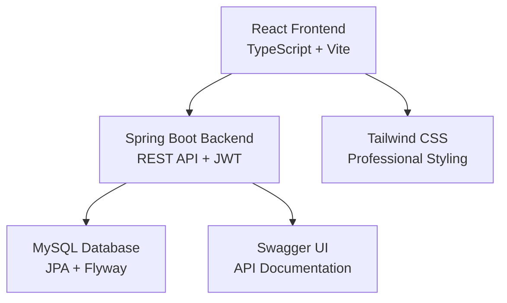

# 🚀 TaskSphere - Enterprise Task Management Platform

<div align="center">


[](https://spring.io/projects/spring-boot)
[](https://reactjs.org/)
[](https://www.typescriptlang.org/)
[](https://www.mysql.com/)
[](https://jwt.io/)
[](https://swagger.io/)

*Professional task management solution with enterprise-grade features*

[🔗 Live Demo](#) | [📖 API Docs](http://localhost:8081/swagger-ui/index.html) | [🛠️ Installation](#installation) | [📁 Features](#features)

</div>

## ✨ **Overview**

TaskSphere is a comprehensive, enterprise-grade task management platform built with modern technologies. It provides a robust foundation for project management, team collaboration, and productivity tracking with professional UI/UX design and comprehensive API documentation.

### 🎯 **Key Highlights**
- **🔐 Enterprise Security**: JWT-based authentication with role-based access control
- **📱 Responsive Design**: Professional UI with Tailwind CSS and modern React patterns
- **📚 API-First**: Complete Swagger/OpenAPI documentation for all endpoints
- **🗄️ Robust Backend**: Spring Boot 3.2 with JPA, Security, and comprehensive error handling
- **⚡ Real-time Updates**: Modern React 18 with TypeScript for type safety
- **🔄 Database Migrations**: Flyway for version-controlled database schema management

---

## 🏗️ **Architecture**



### **Technology Stack**

| Layer | Technology | Version | Purpose |
|-------|------------|---------|---------|
| **Frontend** | React + TypeScript | 18.2 | Modern UI with type safety |
| **Build Tool** | Vite | Latest | Fast development and building |
| **Styling** | Tailwind CSS | Latest | Professional, responsive design |
| **Backend** | Spring Boot | 3.2.0 | Enterprise Java framework |
| **Security** | Spring Security + JWT | Latest | Authentication & authorization |
| **Database** | MySQL | 8.0+ | Reliable data persistence |
| **Migrations** | Flyway | Latest | Version-controlled schema |
| **API Docs** | Swagger/OpenAPI | 3.0 | Interactive API documentation |
| **Build** | Maven | 3.8+ | Dependency management |

---

## 🚀 **Features**

### 👤 **Authentication & Security**
- ✅ User registration with email validation
- ✅ Secure JWT-based login system
- ✅ Password reset with token validation
- ✅ Protected routes and API endpoints
- ✅ Role-based access control
- ✅ Session management

### 📋 **Task Management**
- ✅ Complete CRUD operations for tasks
- ✅ Advanced search and filtering capabilities
- ✅ Task status management (TODO, IN_PROGRESS, COMPLETED)
- ✅ Priority levels (LOW, MEDIUM, HIGH, URGENT)
- ✅ Task assignments and ownership
- ✅ Due date tracking

### 📁 **Project Organization**
- ✅ Project creation and management
- ✅ Task organization within projects
- ✅ Project-based access control
- ✅ Project statistics and analytics
- ✅ Team collaboration features

### 📝 **Personal Notes System**
- ✅ Task-specific personal notes
- ✅ Reminder tags for categorization
- ✅ Rich text content support
- ✅ Note search and filtering
- ✅ Tag-based organization

### 📎 **File Attachments**
- ✅ Multiple file upload support
- ✅ Secure file download
- ✅ File type validation
- ✅ Storage management
- ✅ Attachment statistics

### 📊 **Analytics & Reporting**
- ✅ Task completion statistics
- ✅ Project progress tracking
- ✅ User activity analytics
- ✅ Dashboard with key metrics
- ✅ Export capabilities

### 🎨 **Professional UI/UX**
- ✅ Modern, clean design system
- ✅ Responsive layout for all devices
- ✅ Professional color schemes
- ✅ Intuitive navigation
- ✅ Loading states and error handling
- ✅ Accessibility features

### 📚 **API Documentation**
- ✅ Complete Swagger/OpenAPI 3.0 documentation
- ✅ Interactive API testing
- ✅ Comprehensive endpoint descriptions
- ✅ Request/response examples
- ✅ Authentication integration
- ✅ Error response documentation

---

## 🛠️ **Installation**

### **Prerequisites**
- ☑️ Java 17 or later
- ☑️ Node.js 18 or later  
- ☑️ MySQL 8.0 or later
- ☑️ Maven 3.8 or later

### **Quick Start**

1. **Clone the repository**
```bash
git clone https://github.com/yourusername/tasksphere.git
cd tasksphere
```

2. **Database Setup**
```sql
CREATE DATABASE shareme;
CREATE USER 'shareme'@'localhost' IDENTIFIED BY 'ShareMe@123';
GRANT ALL PRIVILEGES ON shareme.* TO 'shareme'@'localhost';
FLUSH PRIVILEGES;
```

3. **Backend Setup**
```bash
cd backend
mvn clean install
mvn spring-boot:run
```
Backend runs on: `http://localhost:8081`

4. **Frontend Setup**
```bash
cd frontend
npm install
npm run dev
```
Frontend runs on: `http://localhost:3002`

5. **Access the Application**
- 🌐 **Frontend**: http://localhost:3002
- 📚 **API Documentation**: http://localhost:8081/swagger-ui/index.html
- 🔗 **API Base URL**: http://localhost:8081/api

---

## 📱 **Screenshots**

### 🏠 Dashboard Overview
*Professional dashboard with task statistics and quick actions*

### 📋 Task Management
*Comprehensive task list with advanced filtering and search*

### 📝 Notes System
*Personal notes with reminder tags and rich content*

### 📊 Analytics
*Project statistics and progress tracking*

---

## 🔌 **API Endpoints**

### 🔐 **Authentication**
| Method | Endpoint | Description |
|--------|----------|-------------|
| `POST` | `/api/auth/signup` | Register new user |
| `POST` | `/api/auth/login` | User authentication |
| `GET` | `/api/auth/me` | Get current user |
| `POST` | `/api/auth/forgot` | Password reset request |
| `POST` | `/api/auth/reset` | Reset password |

### 📋 **Task Management**
| Method | Endpoint | Description |
|--------|----------|-------------|
| `GET` | `/api/tasks` | Get tasks (with search/filter) |
| `POST` | `/api/tasks` | Create new task |
| `GET` | `/api/tasks/{id}` | Get task details |
| `PUT` | `/api/tasks/{id}` | Update task |
| `PATCH` | `/api/tasks/{id}/status` | Update task status |
| `DELETE` | `/api/tasks/{id}` | Delete task |

### 📁 **Project Management**
| Method | Endpoint | Description |
|--------|----------|-------------|
| `GET` | `/api/projects` | Get user projects |
| `POST` | `/api/projects` | Create project |
| `GET` | `/api/projects/{id}` | Get project details |
| `PUT` | `/api/projects/{id}` | Update project |
| `DELETE` | `/api/projects/{id}` | Delete project |

### 📝 **Notes System**
| Method | Endpoint | Description |
|--------|----------|-------------|
| `GET` | `/api/task-notes/task/{taskId}` | Get task note |
| `POST` | `/api/task-notes` | Save task note |
| `DELETE` | `/api/task-notes/task/{taskId}` | Delete task note |
| `GET` | `/api/task-notes/tag/{tag}` | Get notes by tag |

> 📚 **Complete API Documentation**: Visit `/swagger-ui/index.html` for interactive documentation

---

## 🏗️ **Project Structure**

```
tasksphere/
├── 🗂️ backend/                 # Spring Boot Application
│   ├── 📁 src/main/java/       # Java Source Code
│   │   ├── 🎮 controller/      # REST Controllers
│   │   ├── 📊 service/         # Business Logic
│   │   ├── 🗄️ repository/      # Data Access Layer
│   │   ├── 🏗️ entity/          # JPA Entities
│   │   ├── 📋 dto/             # Data Transfer Objects
│   │   ├── 🔐 security/        # Security Configuration
│   │   └── ⚙️ config/          # Application Configuration
│   ├── 📁 src/main/resources/  # Configuration Files
│   │   ├── 🗃️ db/migration/    # Flyway Migrations
│   │   └── ⚙️ application.properties
│   └── 📄 pom.xml              # Maven Dependencies
├── 🖥️ frontend/                # React Application
│   ├── 📁 src/                 # TypeScript Source
│   │   ├── 🧩 components/      # React Components
│   │   ├── 📄 pages/           # Page Components
│   │   ├── 🔧 services/        # API Services
│   │   ├── 🎨 styles/          # CSS/Tailwind Styles
│   │   └── 🛠️ utils/           # Utility Functions
│   ├── 📁 public/              # Static Assets
│   └── 📄 package.json         # npm Dependencies
├── 🗄️ database/               # Database Scripts
└── 📚 docs/                   # Documentation
```

---

## ⚙️ **Configuration**

### **Backend Configuration** (`application.properties`)
```properties
# Database Configuration
spring.datasource.url=jdbc:mysql://localhost:3306/shareme
spring.datasource.username=shareme
spring.datasource.password=ShareMe@123

# JWT Configuration
app.jwt.secret=YourSecretKey
app.jwt.expiration=900000

# Flyway Configuration
spring.flyway.enabled=true
spring.flyway.locations=classpath:db/migration

# Swagger Configuration
springdoc.api-docs.path=/v3/api-docs
springdoc.swagger-ui.path=/swagger-ui/index.html
```

### **Frontend Configuration** (`.env`)
```env
VITE_API_BASE_URL=http://localhost:8081/api
VITE_APP_TITLE=TaskSphere
VITE_WS_URL=ws://localhost:8081/ws
```

---

## 🚀 **Deployment**

### **Production Checklist**
- [ ] Change JWT secret to production value
- [ ] Configure environment variables
- [ ] Set up HTTPS/SSL certificates
- [ ] Configure proper CORS origins
- [ ] Set up database connection pooling
- [ ] Configure logging levels
- [ ] Set up monitoring and health checks
- [ ] Build frontend for production: `npm run build`
- [ ] Package backend: `mvn clean package`

### **Docker Deployment** (Coming Soon)
```bash
docker-compose up -d
```

---

## 🧪 **Testing**

### **Backend Testing**
```bash
cd backend
mvn test                    # Run unit tests
mvn verify                  # Run integration tests
```

### **Frontend Testing**
```bash
cd frontend
npm test                    # Run component tests
npm run test:e2e           # Run end-to-end tests
```

---

## 🤝 **Contributing**

We welcome contributions! Please follow these guidelines:

1. 🍴 Fork the repository
2. 🌿 Create a feature branch: `git checkout -b feature/amazing-feature`
3. 💻 Make your changes with proper tests
4. 📝 Update documentation as needed
5. ✅ Ensure all tests pass
6. 🚀 Submit a pull request

### **Development Guidelines**
- Follow existing code style and patterns
- Add comprehensive tests for new features
- Update API documentation for new endpoints
- Maintain security best practices
- Write clear commit messages

---

## 📄 **License**

This project is licensed under the MIT License - see the [LICENSE](LICENSE) file for details.

---

## 👥 **Authors & Contributors**

- **[Your Name]** - *Initial work* - [@yourusername](https://github.com/yourusername)

---

## 🙏 **Acknowledgments**

- Spring Boot team for the excellent framework
- React team for the amazing frontend library
- Tailwind CSS for the beautiful styling system
- Swagger team for API documentation tools
- MySQL team for the reliable database
- All open-source contributors

---

## 📞 **Support**

- 📧 **Email**: support@tasksphere.com
- 🐛 **Issues**: [GitHub Issues](https://github.com/yourusername/tasksphere/issues)
- 💬 **Discussions**: [GitHub Discussions](https://github.com/yourusername/tasksphere/discussions)
- 📖 **Documentation**: [Wiki](https://github.com/yourusername/tasksphere/wiki)

---

<div align="center">

**⭐ Star this repository if you find it helpful!**

Made with ❤️ and ☕ by [Your Name]

</div>